# JAVASCRIPT QUIZ APP
The javascript quiz app was created to test users' knowledge of JavaScript with no time limit. There are 10 questions and users will get 10 points for each correct answer.  At the end of the quiz, the total score will be displayed. The maximum score is 100 points. The user has to input a username for the score to be saved. On the end page, a leader board displays the highest scores.                                   

# FINAL DESIGN
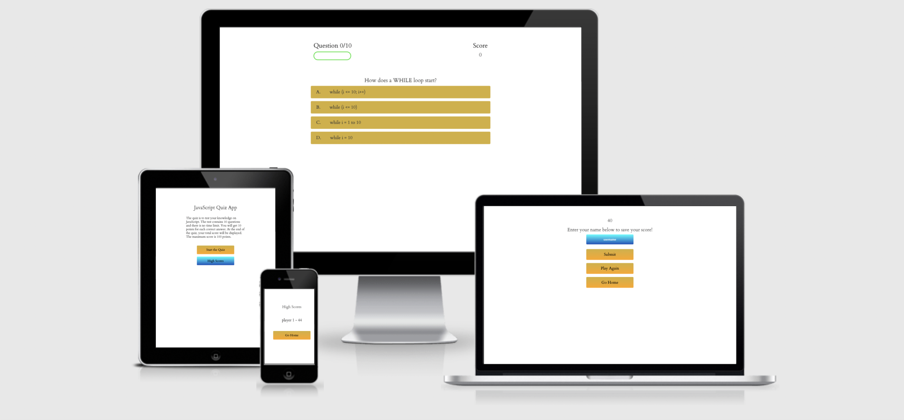

# WIREFRAME
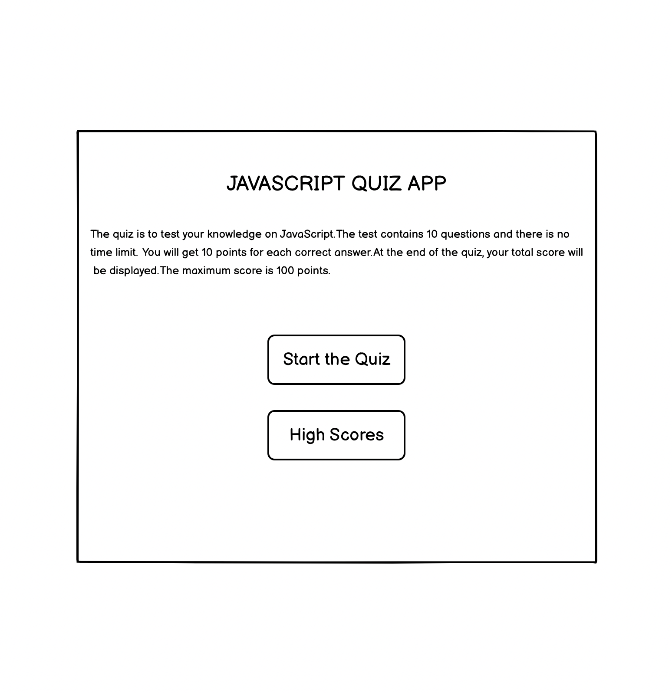
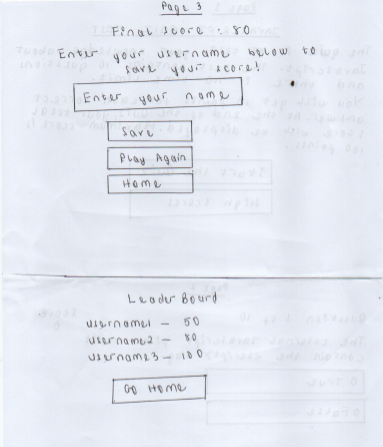
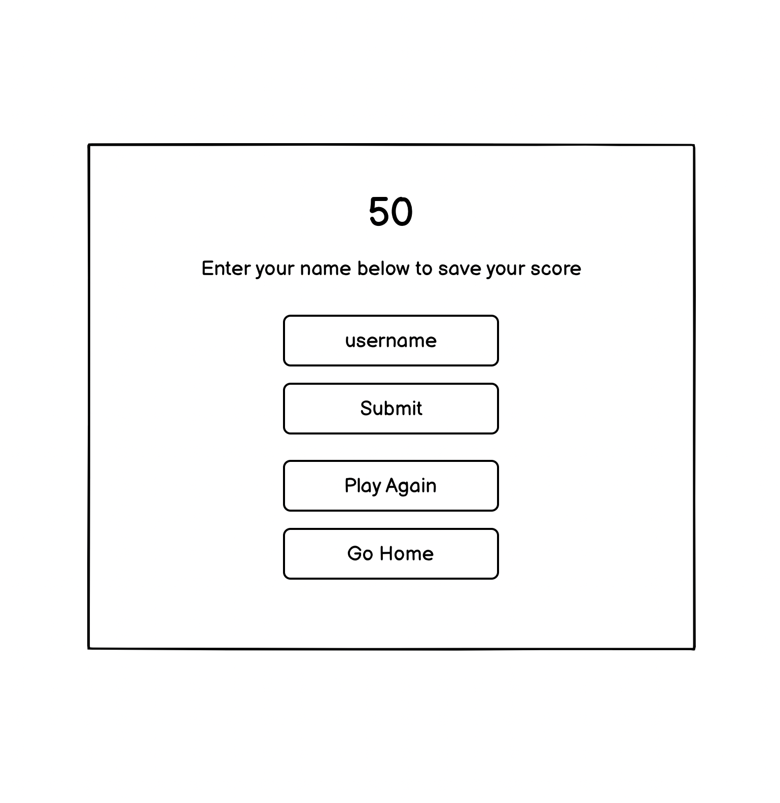
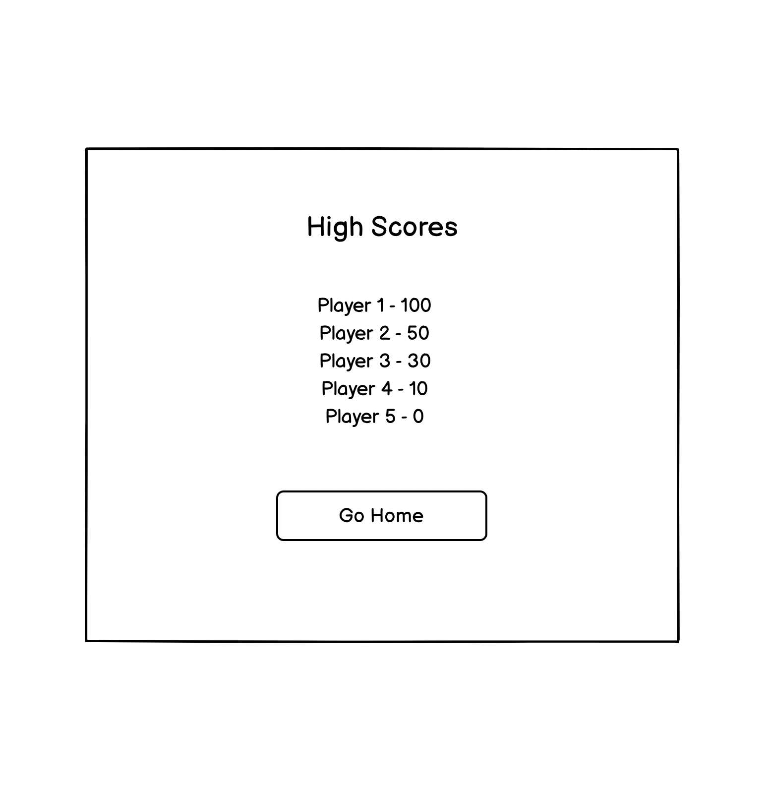

# USER EXPERIENCE(UX) / SITE GOALS
* The game was created using my knowledge of HTML, CSS and JAVASCRIPT.
* The game was created to test and improve users' knowledge of JavaScript.
* Part of the site goals is to make the game easily accessible, providing interactive buttons that are clear as to what they do. 
* The users are provided with some introductory text to familiarise the user with the game. 

# EXISTING FEATURES
## The Landing Page
* Featured on the home page is the title, JavaScript Quiz Test and some brief description to familiarise the user with the game.  
* Beneath this are the links to start the quiz and to get high scores. 
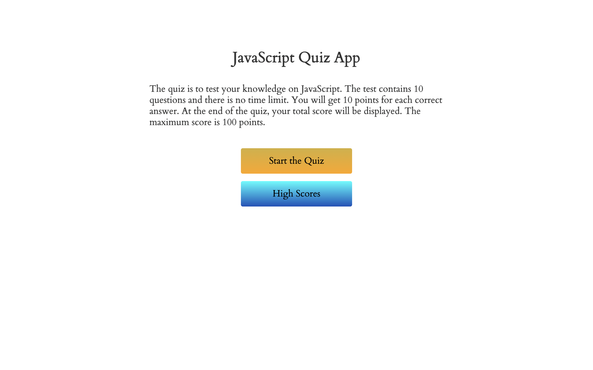

## Start the Quiz
* The user begins the quiz by clicking on "Start the Quiz".
* At the top is a score tracking system. This displays the question number and a bar which increases after each question. 
* The score increases by 10 points for each correct answer. The score remains the same and is not increased if the user gets the answer wrong. 
* Next is the question displayed with four options to choose from. 
* The user is directed to the next question after choosing an answer. 

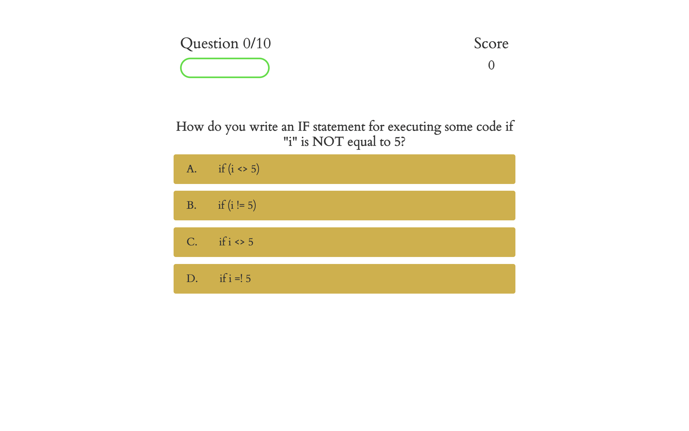
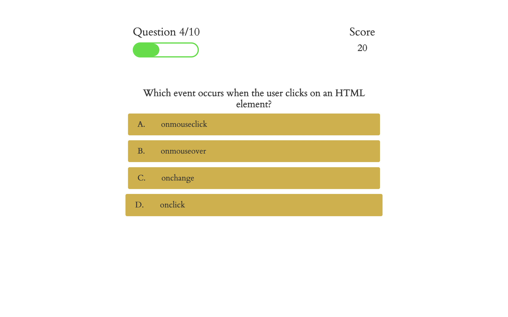

## The End Page
* The user is directed to an end page after completing the quiz. The user has to input a username to save and submit the game. 
* The user also has the option to play again or return to the home page. 

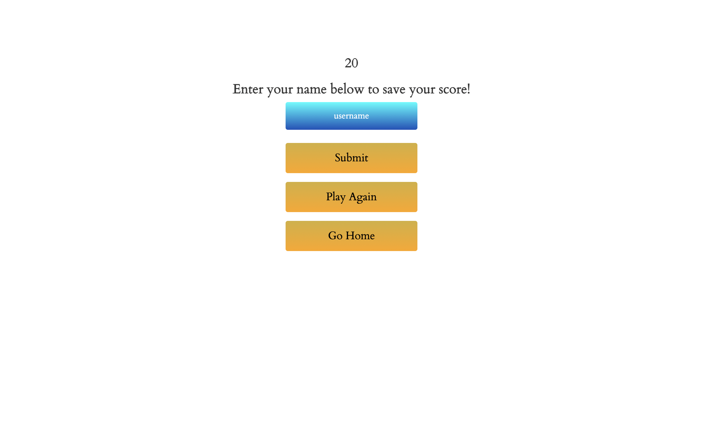

## The High Scores
* Featured in the high scores is a leader board showing the top 5 high scores and their respective usernames. 
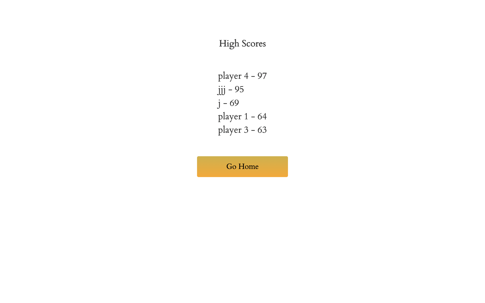

# DESIGN
## Color Scheme
I wanted a simple and basic colour scheme, using a white background for all pages, gold and blue shade for the navigations and green colour for the progress bar. 
## Typography
The "Cardo" font used for the site was imported from [Google Fonts](https://fonts.google.com/).

# TECHNOLOGY USED
* Google Fonts: Google Fonts was used to import the font used for all the text content on the site pages.
* Git: Git was used for version control by using the Gitpod terminal to commit to Git and push to GitHub.
* GitPod: GitPod was used as an IDE whilst coding this site.
* GitHub: GitHub is being used to store all the code for this project after being pushed from GitPod.
* Am I Responsive: Am I Responsive was used to create the images in the Final Design section.
* Chrome Developer Tools: Chrome Developer Tools was used for troubleshooting and trying new visual changes without it affecting the current code.

# TESTING
* I tested that this page works in different browsers.
* I have ensured that this project is responsive, looks good and functions on all standard screen sizes using the dev tools device toolbar.
* I have confirmed that all texts are readable and easy to understand.

# VALIDATOR TESTING
The [W3C Markup Validator](https://validator.w3.org/nu/?doc=https%3A%2F%2Foyindamolabadara.github.io%2Fjavascript-quiz-app%2F) and [W3C CSS Validator](https://jigsaw.w3.org/css-validator/validator?uri=https%3A%2F%2Foyindamolabadara.github.io%2Fjavascript-quiz-app%2F&profile=css3svg&usermedium=all&warning=1&vextwarning=&lang=en) and [JSHint](https://jshint.com/) was used to validate my project to make sure no errors were returned.

# LIGHTHOUSE
I ran the game live through Chrome Lighthouse and received the following result:
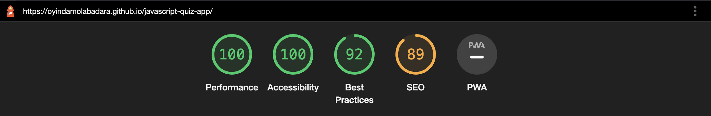

# SOLVED BUGS
* On the JSHint Validator, there was an error message about the use of esversion:6. This was fixed by adding /*jshint esversion: 6 */ to the code. 
* There was also another JS error on changing ['number'] to a dot notation, which was fixed. 
* Users were able to save their score without including a name, making the save function pointless. The submit function was disabled until text had been entered into the name bar.

# DEPLOYMENT
* The site was deployed to GitHub pages. The steps to deploy are as follows:
  * In the GitHub repository, navigate to the Settings tab.
  * From the source section drop-down menu, select the Master Branch.
  * Once the master branch has been selected, the page will be automatically refreshed with a detailed ribbon display to indicate the successful deployment.
[The live link can be found here.](https://oyindamolabadara.github.io/javascript-quiz-test/) 

# CREDITS
Most of the quiz questions were taken from the [W3 Schools Website](https://www.w3schools.com/js/js_quiz.asp) with some adjustments. 

# ACKNOWLEDGEMENTS
  * The JavaScript code was written using [James Q Quick](https://www.youtube.com/c/JamesQQuick/featured) tutorials. 
  * I would like to thank [AbdulFattah Badara](https://github.com/fobadara) for his support during this project. 